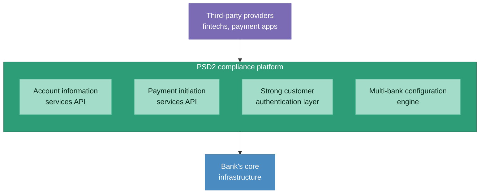
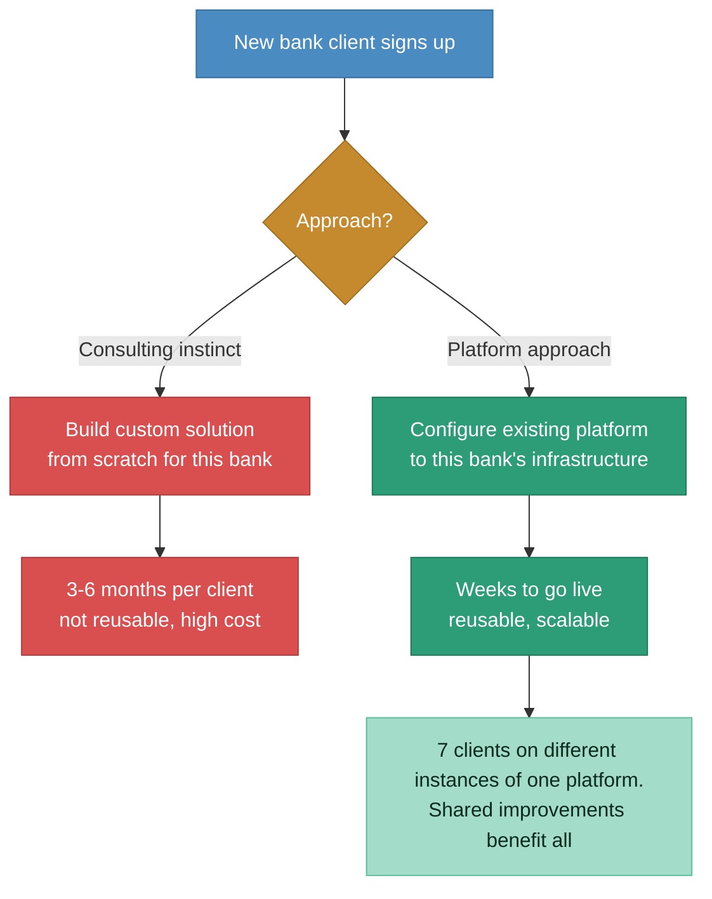
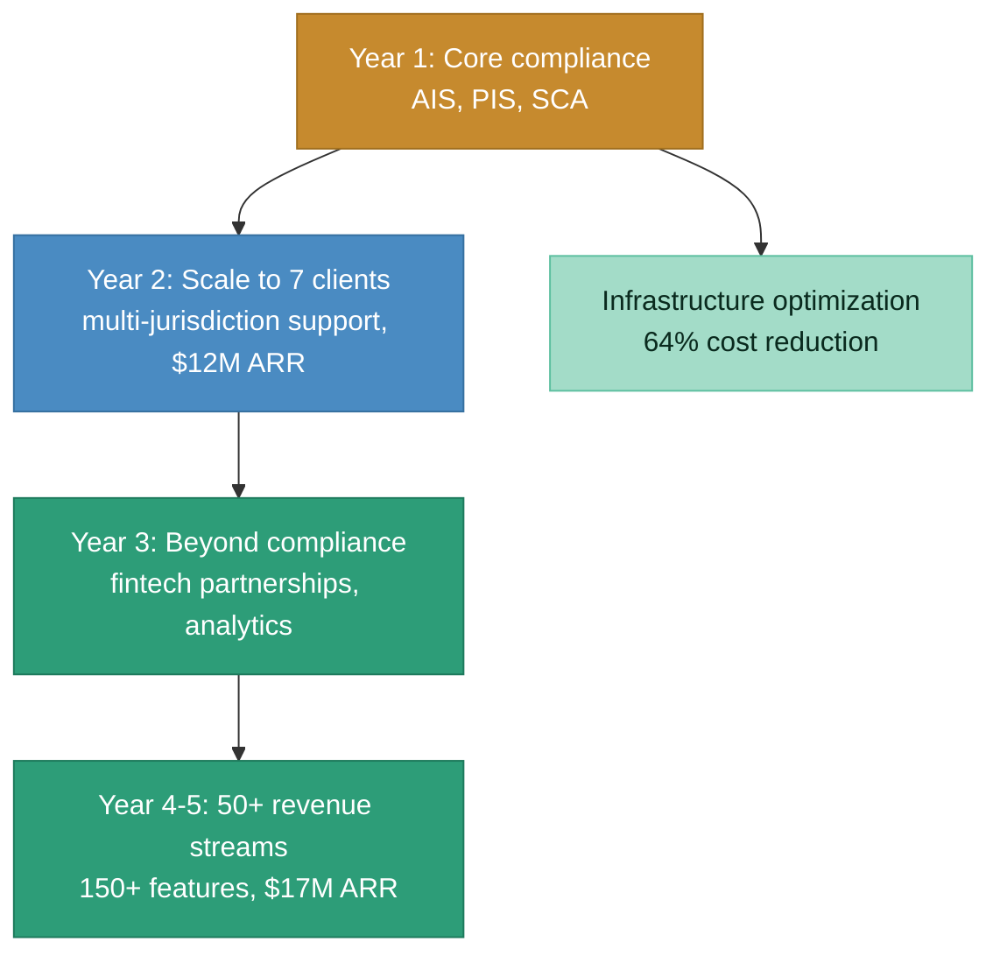
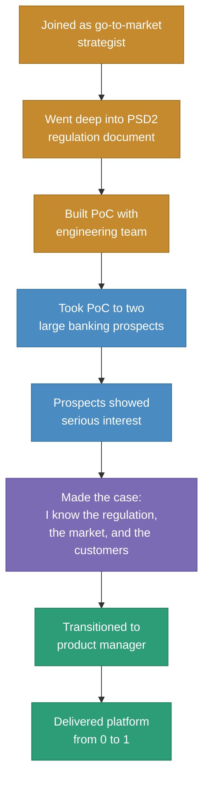

# After state: turnkey PSD2 platform scaled to 7 global clients

> One platform, configurable per bank, $17M ARR. Compliance achieved in short turnaround times. 50+ revenue streams beyond the initial compliance use case.

### Platform vs. bespoke: the architecture decision

### 5-year roadmap: compliance as floor, revenue as ceiling

### My role transition

## Before vs. after comparison

| Dimension | Before | After |
|-----------|--------|-------|
| **PSD2 compliance** | Banks had no infrastructure. Non-compliance meant being locked out of payments ecosystem. | Turnkey platform achieves compliance in short turnaround time. |
| **Market offering** | No platform-based solution existed. Only bespoke consulting builds or immature fintech offerings. | One configurable platform serving 7 global clients across European jurisdictions. |
| **Time to compliance** | 12-18+ months for in-house builds | Weeks to months via platform configuration |
| **Revenue** | Zero (pre-product) | $17M ARR |
| **Revenue streams** | None | 50+ revenue streams across the 5-year roadmap |
| **Features** | PoC only | 150+ features shipped |
| **Operational costs** | Over-provisioned for small banks, under-provisioned for large ones | 64% reduction through infrastructure recalibration |
| **Client base** | 2 PoC prospects | 7 global banking clients |
| **Approach** | Consulting firm instinct: bespoke per client | Platform approach: one core, configurable per bank |
| **My role** | Go-to-market strategist | Product manager owning the full product lifecycle |

## Key architectural decisions

**Why platform, not bespoke:**
The parent organization was a consulting firm. Their DNA was to build custom for every client. I pushed for a platform approach because: (a) bespoke builds aren't reusable, so client #7 costs the same as client #1, (b) improvements for one client benefit all clients on the platform, and (c) a platform generates recurring product revenue, not one-time consulting fees. This was a constant negotiation internally.

**Why multi-jurisdiction configuration, not separate instances:**
European banks operate under different national regulators even within PSD2. Rather than spinning up a separate platform instance for each jurisdiction, we built a configuration engine that handled jurisdiction-specific requirements (authentication flows, data residency, reporting formats) as parameters, not code changes.

**Why infrastructure optimization mattered:**
With 7 clients of varying sizes, the same infrastructure allocation didn't make sense. Small banks were over-provisioned (paying for capacity they didn't use), large banks were occasionally under-provisioned (hitting performance limits during peak transaction volumes). Recalibrating based on actual performance metrics cut operational costs by 64% without any SLA impact.
