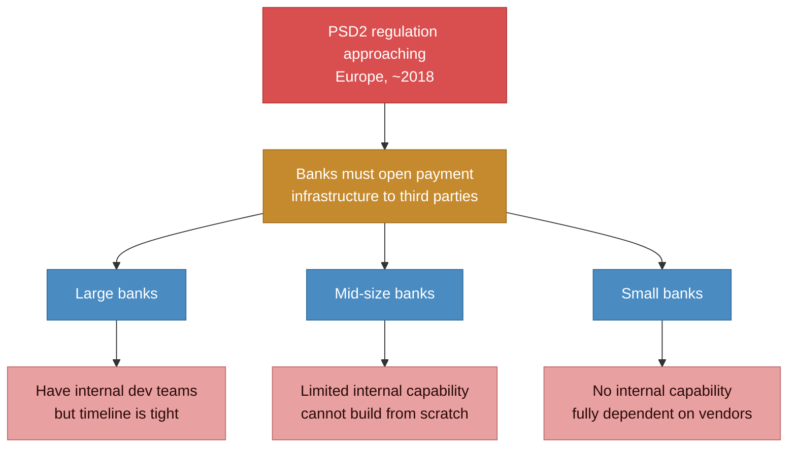
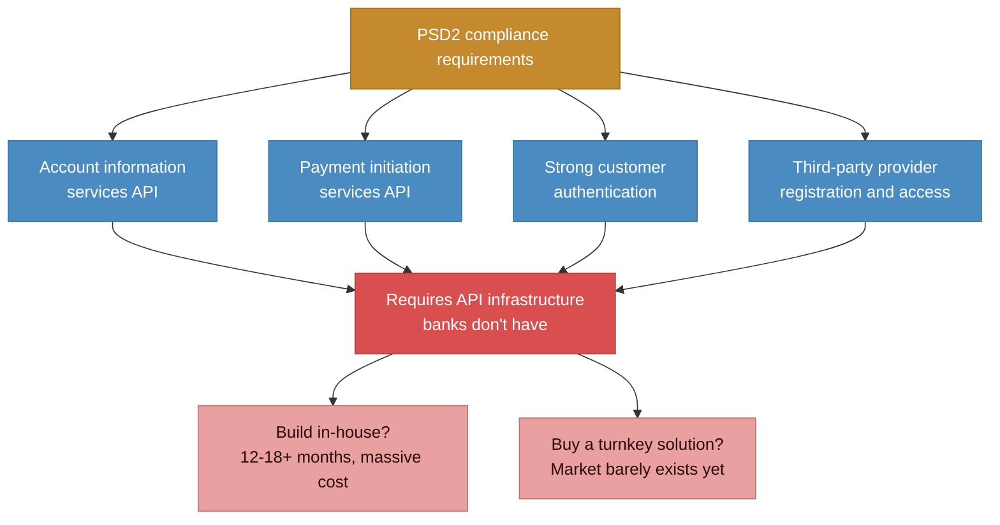
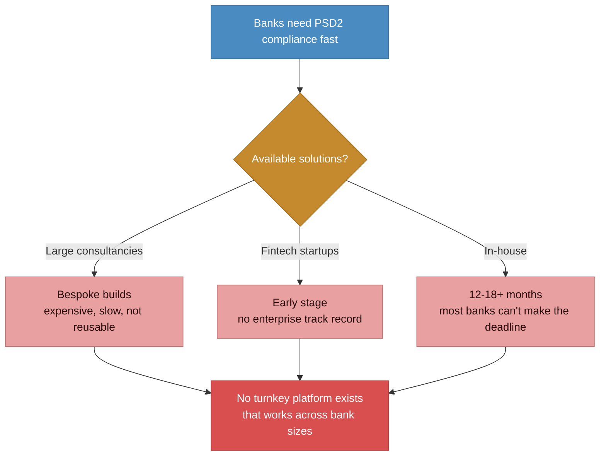

# Before state: banks facing PSD2 with no infrastructure

> PSD2 regulation mandates open banking APIs. Most banks, especially small and mid-sized, have no internal capability to build compliant infrastructure from scratch. Deadline approaching.

### What PSD2 compliance required

### The market gap

## Pain points summary

| Problem | Impact |
|---------|--------|
| **Regulatory deadline with no infrastructure** | Banks must comply with PSD2 but most lack the API infrastructure to do so. Non-compliance means being locked out of the payments ecosystem. |
| **No turnkey solutions in the market** | Large consultancies offered bespoke builds (expensive, slow). Fintechs were too immature for enterprise banking. No one had a platform approach. |
| **Each bank has different legacy systems** | Core banking systems vary wildly. Any solution needs to integrate with each bank's existing infrastructure, not replace it. |
| **Compliance is the floor, not the ceiling** | Banks focused only on "how do we comply?" but the real opportunity was in what open APIs could enable after compliance: fintech partnerships, new payment experiences, data analytics. |
| **Consulting firm DNA vs. product thinking** | The parent organization's instinct was to build bespoke solutions for each client. A scalable platform approach required fighting that instinct. |
